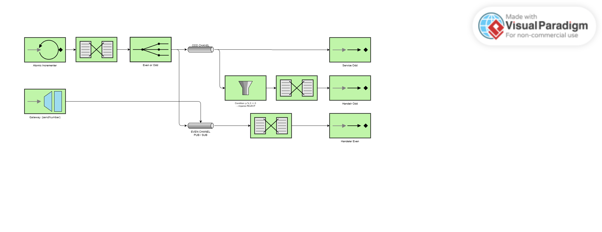

# Lab 5 Integration and SOA - Project Report

## 1. EIP Diagram (Before)



Describe what the starter code does and what problems you noticed.

El código inicial implementaba un sistema de integración que procesaba números y los enrutaba según fueran pares o impares, pero contenía varios errores deliberados como parte del ejercicio.

El flujo comenzaba con un `AtomicInteger` que generaba números secuenciales cada 100ms. Estos números pasaban por un transformer que los registraba en el log y luego por un router que decidía si enviarlos a `evenChannel` o `oddChannel` según el resultado de `p % 2 == 0`.

Además, se inyectaban números negativos aleatorios cada segundo a través del gateway `SendNumber`.

**Problemas observados en la ejecución inicial:**

1. Los números impares generados por el poller se comportaban de forma inconsistente: algunos eran rechazados por un filtro y otros llegaban al service activator directamente sin transformación.

2. Los números negativos del gateway siempre iban al canal de números pares, independientemente de si eran realmente pares o impares.

3. Aparecían errores en el log indicando que los mensajes eran rechazados por un filtro que supuestamente debería aceptarlos.

---
## 2. What Was Wrong

Explain the bugs you found in the starter code:

- **Bug 1**: What was the problem? Why did it happen? How did you fix it?
- **Bug 2**: What was the second problem? Why did it happen? How did you fix it?
- **Bug 3**: What was the third problem? Why did it happen? How did you fix it?
- **(More bugs if you found them)**

### **Error 1: Filtro invertido en oddFlow**

**Problema:** El flujo `oddFlow` contenía un filtro con la condición `p % 2 == 0`, que acepta números **pares** en lugar de impares. Esto causaba que todos los números impares que llegaban a este flujo fueran rechazados inmediatamente.

**Por qué ocurría:** Era un error escrito a proposito diseñado al revés: aceptaba pares cuando debería aceptar impares.

**Solución:** Cambié la condición del filtro de `p % 2 == 0` a `p % 2 != 0` para que aceptara los números impares. Esto permitió que los mensajes pasaran al transformer y al handler sin ser rechazados.

### **Error 2: Canal incorrecto para el Gateway**

**Problema:** El gateway `SendNumber` estaba configurado con `@Gateway(requestChannel = "evenChannel")`, enviando todos los números negativos directamente al canal de pares.

**Por qué ocurría:** El gateway no pasaba por el clasificador de números par o impar, sino que enviaba directamente a un canal fijo.

**Solución:** Cambié el `requestChannel` del gateway a `"routingChannel"` en lugar de `"evenChannel"`. De esta forma, los números inyectados por el gateway también pasan por el router que usa `abs(p) % 2 == 0` para clasificarlos correctamente.

### **Error 3: oddChannel como DirectChannel en lugar de PublishSubscribe**

**Problema:** El canal `oddChannel` no estaba definido, por lo que se creaba un `DirectChannel` por defecto. Esto causaba que los mensajes se repartieran entre los dos suscriptores (`oddFlow` y `SomeService`) en lugar de que ambos recibieran todos los mensajes.

**Por qué ocurría:** Faltaba la definición del bean `oddChanel` comoo directChannel, cada mensaje solo llega a UN suscriptor, no a todos.

**Solución:** Agregué la definición explícita del bean:
```kotlin
@Bean
fun oddChannel(): PublishSubscribeChannelSpec<*> = MessageChannels.publishSubscribe()
```

Así ambos suscriptores reciben todos los mensajes impares simultáneamente.

### **Error 4: Handler faltante en oddFlow**

**Problema:** Después de corregir los errores anteriores, el `oddFlow` terminaba con un transformer que producía un `String`, pero no tenía un handler final que consumiera ese mensaje. Esto generaba la excepción `DestinationResolutionException: no output-channel or replyChannel header available`.

**Por qué ocurría:** Se necesita que los flujos tengan un consumidor final o un canal de salida definido. El transformer producía un mensaje que no tenía destino. Lo borré y no me di cuenta.

**Solución:** Lo anñadí de nuevo:
```kotlin
handle { p ->
    logger.info("  ✅ Odd Handler: Processed [{}]", p.payload)
}
```

---

## 3. What You Learned

Write a few sentences about:

- What you learned about Enterprise Integration Patterns
- How Spring Integration works
- What was challenging and how you solved it

Esta práctica me ha permitido entender en profundidad cómo funcionan los **Enterprise Integration Patterns**.

Lo más desafiante fue definitivamente **seguir el flujo de los mensajes** a través de los diferentes tipos de canales. Al principio no entendía por qué algunos números impares se procesaban correctamente y otros no, hasta que descubrí la diferencia entre `DirectChannel` y `PublishSubscribeChannel`. Los DirectChannel reparten los mensajes entre suscriptores (round-robin), mientras que los PublishSubscribe envían una copia a cada uno.

El proceso de analizar el código erróneo, crear el diagrama EIP, compararlo con el objetivo y después implementar las correcciones me ha ayudado a entender mejor cuándo usar cada tipo de canal y cómo estructurar flujos de integración de forma correcta.

---

## 4. AI Disclosure

**Did you use AI tools?** (ChatGPT, Copilot, Claude, etc.)

- If YES: Which tools? What did they help with? What did you do yourself?
- If NO: Write "No AI tools were used."

**Important**: Explain your own understanding of the code and patterns, even if AI helped you write it.

Sí, utilicé **ChatGPT** durante esta práctica.

**Para qué lo usé:**
- Entender el código inicial y cómo fluían los mensajes a través de los diferentes componentes
- Comprender las diferencias entre los tipos de canales (DirectChannel vs PublishSubscribeChannel)
- Cuando me quedé atascado con el error del handler faltante, ChatGPT me explicó que los transformers necesitan un consumidor final

**Lo que hice yo mismo:**
- Ejecutar la aplicación y observar el comportamiento real en los logs.
- Identificar los patrones de error (números rechazados, inconsistencias).
- Crear el diagrama EIP del sistema inicial.
- Implementar todas las correcciones en el código.

**Mi comprensión:** Ahora entiendo que en Spring Integration los mensajes fluyen a través de canales que conectan diferentes componentes. Los canales PublishSubscribe son necesarios cuando múltiples componentes deben procesar el mismo mensaje, mientras que los DirectChannel son para procesamiento secuencial y cada flujo debe terminar con un handler o tener un canal de salida definido.

---

## Additional Notes

Any other comments or observations about the assignment.
